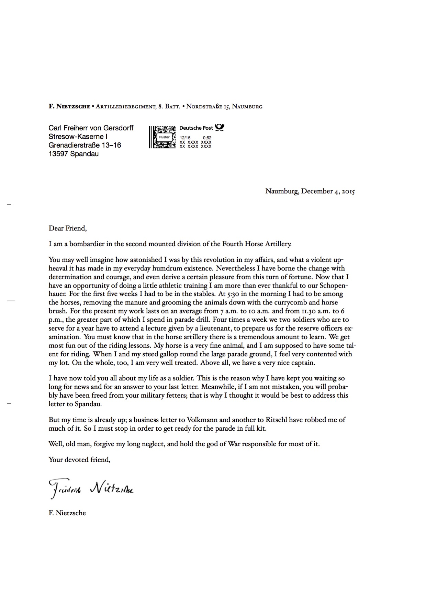

# Letter Boilerplate

A boilerplate to quickly and painlessly generate high-quality letters through LaTeX.

Why settle for MS Word when you can get the job done using your text editor?



## Dependencies

1. LaTeX with the following extra packages: `fontspec` `geometry` `ragged2e` `enumitem` `xunicode` `xltxtra` `hyperref` `polyglossia` `footmisc` (also, `datetime2` plus its language modules if you want to use a custom date, see below in the settings section)
2. [Pandoc](http://pandoc.org/), the universal document converter.
3. [KOMA-Script](http://www.komascript.de/) for adding folding markers (optional)

To install LaTeX on Mac OS X, I recommend getting the smaller version BasicTeX from [here](https://tug.org/mactex/morepackages.html) and installing the additional packages with `tlmgr` afterwards. Same goes for Linux: install `texlive-base` with your package manager and add the needed additional packages later. To get `tlgmr` running do the following after installing:

```
sudo tlmgr update --self
sudo tlmgr update --all
```

To install pandoc on Mac OS X, run `brew install pandoc`. To install it on Linux, refer to the [official docs](http://pandoc.org/installing.html).

KOMA-Script is easily installed with `tlmgr` as well, [summary from the KOMA-Script website](http://www.komascript.de/node/1801):

```
tlmgr repository add https://www.komascript.de/repository/texlive/2020 KOMA
tlmgr pinning add KOMA koma-script
tlmgr install --reinstall koma-script
```

## Getting started

1. Open `letter.md` and fill the YAML frontmatter with your details, your recipient's details, optional subject line, and the desired settings.
2. Write your letter in markdown below.
3. Run `make` to compile the PDF.

If a file named `signature.pdf` is present in the directory, the boilerplate will automatically print it after the letter's body as a final touch. Follow [this method](http://tex.stackexchange.com/a/32940/82423) to import your own signature.

**Note**: this template needs to be compiled with XeTeX.

### Note for Windows users

Although I didn't test it, you can probably use this on Windows, too. Both [Pandoc](http://pandoc.org/installing.html) and LaTeX can be installed on Windows (I recommend [MiKTeX](http://miktex.org/) for that) and you should be able to run makefiles on Windows through [Cygwin](https://www.cygwin.com/). If that's too much hassle, this command should do the trick in Powershell:

    pandoc letter.md -o output.pdf --template=template.tex --pdf-engine=xelatex

## Available settings

- **`subject`**: The letter's subject (optional)
- **`mainfont`**: Hoefler Text is the default, but every font installed on your system should work out of the box (thanks, XeTeX!)
- **`altfont`**: Used to render the recipient address so that it stands out from the rest of the letter.
- **`fontsize`**: Possible values here are 10pt, 11pt and 12pt.
- **`lang`**: Sets the main language through the `polyglossia` package. This is important for proper hyphenation and date format.
- **`geometry`**: A string that sets the margins through `geometry`. Read [this](https://www.sharelatex.com/learn/Page_size_and_margins) to learn how this package works.
- **`letterhead`**: include custom letterhead in the PDF (see below).
- **`customdate`**: Allows you to specify a custom date in the format YYYY-MM-DD in case you need to pre/postdate your letter. *Caveat*: Requires `datetime2` along with its language module (ex: if `lang` is set to `german` do `tlmgr install datetime2 datetime2-german`)
- **`foldingmarkers`**: add folding markers to the page margin (optional).
- **`internetmarke`**: add Deutsche Post Internetmarke to the header (optional). See https://internetmarke.deutschepost.de, purchase with option "Adresse hinzufügen".
- **signatureright**: if `true` shift the signature to the right, default is `false`
- **windowedenvelope**: if `true` the address block is shifted 1.1mm to the left to fit windowed envelopes, default is `false`

## Custom letterhead

If you have already designed your own letterhead and want to use it with this template, including it should be easy enough. Set the `letterhead` option to `true` to activate the `wallpaper` package in the template. `wallpaper` will look for a file named `letterhead.pdf` in the project root folder and print it on the PDF before compiling the document. Change the fonts to match the ones in your letterhead, adjust the margins with `geometry` and you should be all set.

## Recommended readings

- [Typesetting Automation](http://mrzool.cc/writing/typesetting-automation/), my article about this project with in-depth instructions and some suggestions for an ideal workflow.
- [The Beauty of LaTeX](http://nitens.org/taraborelli/latex) by Dario Taraborelli
- [Letterhead advices](http://practicaltypography.com/letterhead.html) from Butterick's Practical Typography
- [Multichannel Text Processing](https://ia.net/topics/multichannel-text-processing/) by iA
- [Why Microsoft Word must Die](http://www.antipope.org/charlie/blog-static/2013/10/why-microsoft-word-must-die.html) by Charlie Stross
- [Word Processors: Stupid and Inefficient](http://ricardo.ecn.wfu.edu/~cottrell/wp.html) by Allin Cottrell
- [Proprietary Binary Data Formats: Just Say No!](http://www.podval.org/~sds/data.html) by Sam Steingold
- [Sustainable Authorship in Plain Text using Pandoc and Markdown](http://programminghistorian.org/lessons/sustainable-authorship-in-plain-text-using-pandoc-and-markdown) by Dennis Tenen and Grant Wythoff

## Resources

- Refer to [pandoc's documentation](http://pandoc.org/MANUAL.html#templates) to learn more about how templates work.
- If you're not familiar with the YAML syntax, [here](http://learnxinyminutes.com/docs/yaml/)'s a good overview.
- If you want to edit the template but LaTeX scares you, these [docs](https://www.sharelatex.com/learn/Main_Page) put together by ShareLaTeX cover most of the basics and are surprisingly kind to the beginner.
- Odds are your question already has an answer on [TeX Stack Exchange](https://www.sharelatex.com/learn/Main_Page). Also, pretty friendly crowd in there.
- Need to fax that letter? Check out [Phaxio](https://www.phaxio.com/) and learn how to send your faxes from the command line with a simple API call.

## See also

- [invoice-boilerplate](https://github.com/mrzool/invoice-boilerplate) — Simple automated LaTeX invoicing system
- [cv-boilerplate](https://github.com/mrzool/cv-boilerplate) — Easing the process of building and maintaining a CV using LaTeX

## License

[MIT](https://opensource.org/licenses/MIT)
